# Control systems Engineer
I work at Ducati, a leader in motorcycle engineering, where I have the opportunity to grow professionally while passionately contributing to innovative projects. I am passionate about leveraging technology to drive progress and am committed to continuous learning.      
In my field, I don't agree with "no pain, no gain", I would prefer "no brain, no gain". Pain is guaranteed but results aren't 🧠  
For those who are not in the field, here's an example of a popular control system: Cruise Control.  

 
  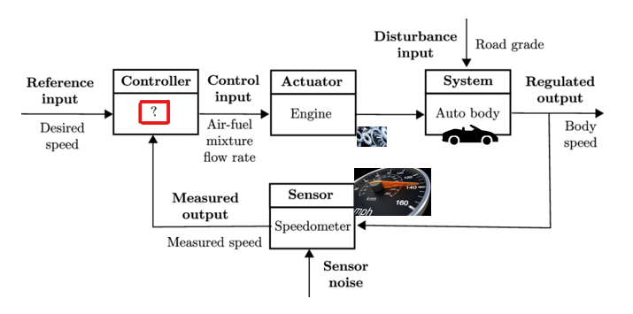

The control systems engineer's goal is to design what's inside the red box. This is very riductive, I could write a +100pages book on the roles of a control systems engineer but, the above scheme is meant to give a great intuition!

## Projects 💻
### PiL Simulation of a photovoltaic control system 

Project overview 

This project aims at simulating photovoltaic (PV) arrays and a boost converter in Simulink, and integrating the Perturb and Observe (P&O) algorithm for Maximum Power Point Tracking (MPPT) using a Texas Instruments board, in particular, the LAUNCHXL-F28379D development kit. The project focuses on the realization of serial communication between MATLAB and the Texas Instruments board for the purpose of achieving a Processor-in-the-Loop (PiL) simulation.
After that, an enhanced version of the P&O algorithm has been implemented: the variable step version. The purpose here is to study how the algorithm performs under partial shading condition of the PV arrays.  
Unlike the conventional P&O algorithm, which uses a fixed step size for perturbations, the variable step P&O algorithm dynamically adjusts the step size based on the PV array’s
behavior. This approach helps to reduce oscillations around the MPP and enhance the system’s overall power generation capabilities. The final achieved PiL simulation can be schematized as shown here

 
  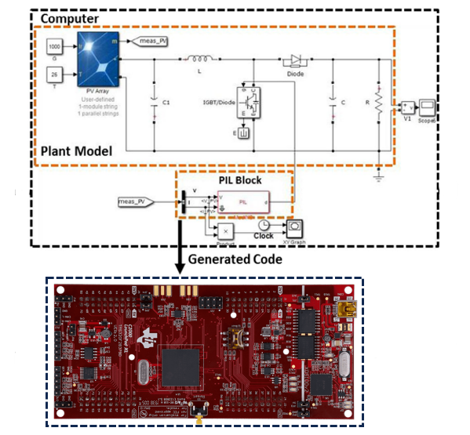

 

[Full repository](https://github.com/FedericoTiberti/MPPT-array-control-real-time).

### MoCap system for UAV trajectory control 

Project overview

The goal of this project is to successfully control the trajectory of a Crazyflie 2.X drone from a target PC exploiting data of the Motion Capture (MoCap) system equipped with four infrared cameras. This system allows the drone to follow a target trajectory starting at any given point in the range of view of the Optitrack cameras. The trajectory is generated after the drone has successfully taken off, this trajectory is based on the measured position from the cameras and a set of target points that can be fixed by the user.  
Without this system, the UAV could only move relatevely to itself. Therefore, it has been crucial to introduce the MoCap system!  

If you are curious about it and you want to know more, just click the link to the repository below! 

 

[Full repository](https://github.com/FedericoTiberti/Drone-trajectory-tracking).

### Proximity detection using Bluetooth Low Energy packet sniffers

Project overview

Let me start with a picture:

 
  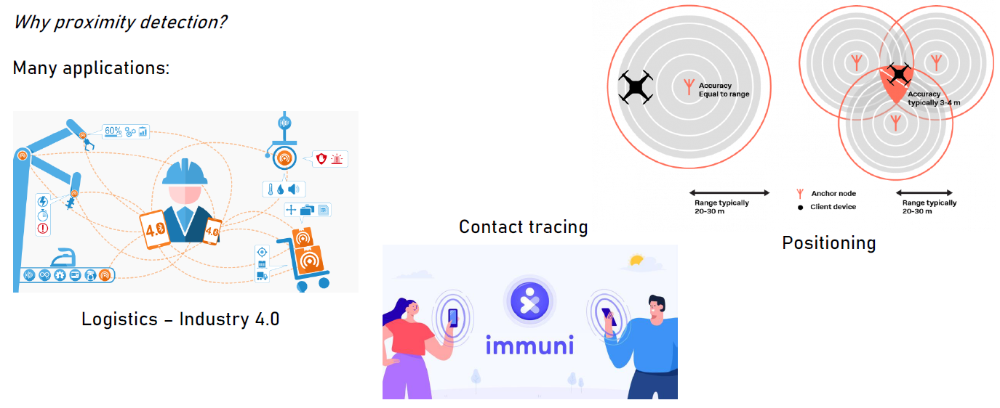

The project is based on a measurement campaign adressed to the collection of Received Signal Strength Indicator (RSSI) measurements received from the sniffer.
The goal is to derive configuration guidelines for transmission schemes and thresholds to be  used in contact tracing and exposure notification services. Proximity detection has been obtained in different scenarios employing different types of sniffers:  

  - Android smartphone with the nRF Connect app.  
  - nRF52-DK (properly configured) used on Wireshark SW.  
  - CC2540 (Texas dongle) used on Packet-Sniffer SW.  
  
To achieved the prefixed objective, the following steps have been followed:  
  - Dongle setup throught nRF Mesh for periodic signal transmission  
  - Texas & Nordic HW setup
  - Measurements & Data Log
  - Post Processing & Data Visualization  
  
To get deeper details and understand the final result, check out the repository. 

 

[Full repository](https://github.com/FedericoTiberti/BLE-sniffing/tree/main).

### Nonlinear control of Hybrid Energy Storage System

Project overview

This project is focused on the simulation and control of a Hybrid Energy Storage System (HESS) for electric vehicles. The HESS consists of two power sources: a Fuel Cell (FC) as the main source and a Supercapacitor (SC) as the auxiliary source. The system is designed to optimize the power distribution between these sources while ensuring stability, efficiency, and performance.  
The nonlinear controller used in this system ensures optimal performance by meeting the following key objectives:

1. **Tight DC Bus Voltage Regulation**: The DC bus voltage must remain stable despite variations in load demand.
2. **Accurate Supercapacitor Current Tracking**: The current of the supercapacitor should follow its reference value accurately to ensure optimal auxiliary power supply.
3. **Asymptotic Stability**: The entire closed-loop system, including both power sources and converters, must maintain stability over time.

If you want to check the performances and simulate the system on your own, access the repository and... Happy simulating! 🚗🔋⚡ 

 

[Full repository](https://github.com/FedericoTiberti/Control-of-FuelCell-Supercapacitor-Hybrid-System).

## Work Experience 💼
**Control Systems engineer @ Ducati Motor Holding 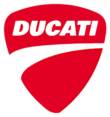 (_April 2024 - Present; Bologna_)** 
- In the _Control Strategies & Innovation_ R&D team, I am involved in the whole V-model process.
- As a member of this team, I am responsible for the design, implementation and validation of 3 control strategies. In addition, each of us is responsible for proposing innovative ideas to be evaluated and possibly explored. 💡 

**Internship - Electronic software engineer @ Ferrari (_October 2023 - March 2024; Maranello_)**
- In the _Sensors & Applications_ R&D team, I worked on different sensing technologies.
- I also developed a testing framework for electronic devices (mainly ECUs and sensors) using LabVIEW.

**Internship - Master thesis project on Virtual Sensing @ Toyota Motor Europe (_March 2023 - September 2023; Brussels_)**
- In the _Connected Powertrain_ R&D team, I worked on a virtual sensor project developing and deploying a machine learning model.

## Education 📚
**MSc in Control Systems Engineering (_2021 - 2023_)**
- In my master's program, I focused on control systems, studying advanced topics such as Kalman filters, nonlinear systems, Model Predictive Control and system identification algorithms.
- In 2022, I participated in two outstanding events
  1. Summer school in the Netherlands on Artificial Intelligence and Machine Learning. During the week we went canoeing!  
    &nbsp;&nbsp;&nbsp;&nbsp; 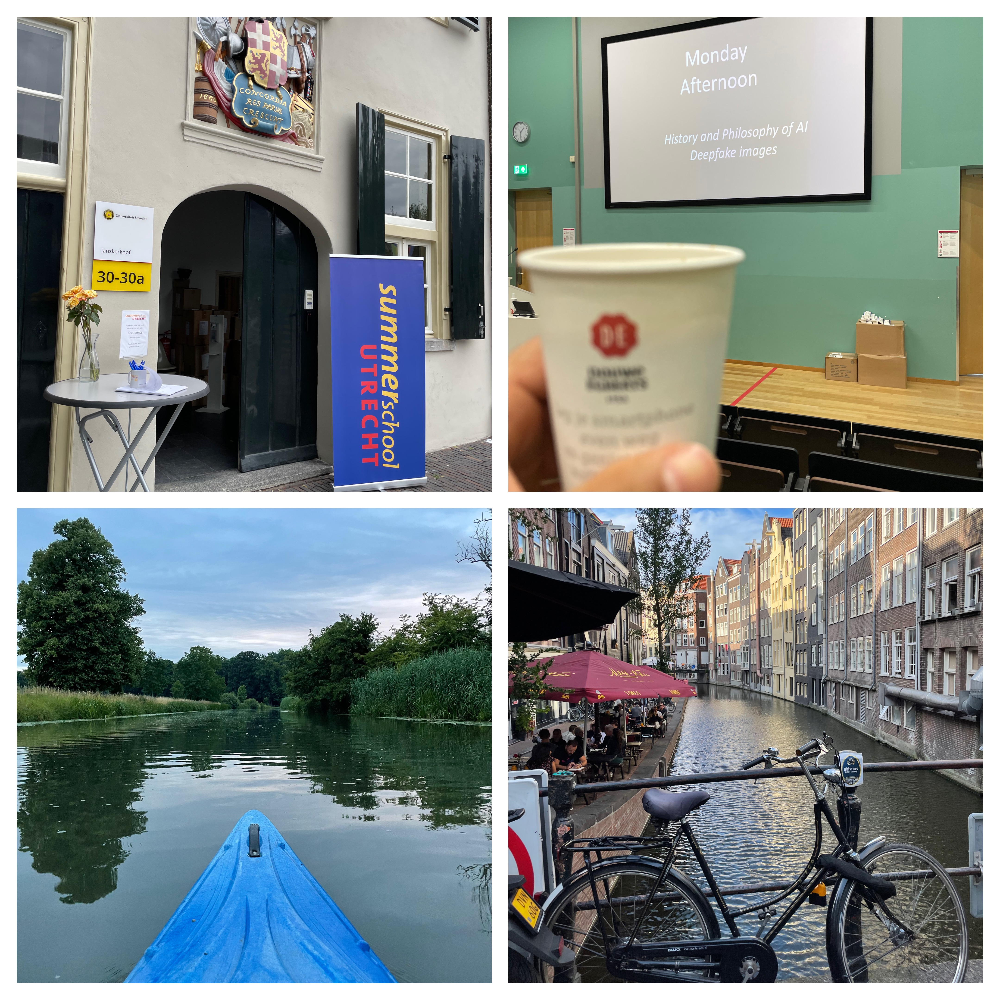  
  2. Workshop with the **_Shibaura Institute of Technology_**, where we worked in a group of four - two Italians and two Japanese - on a project focused on Skill Transfer.  
     &nbsp;&nbsp;&nbsp;&nbsp; 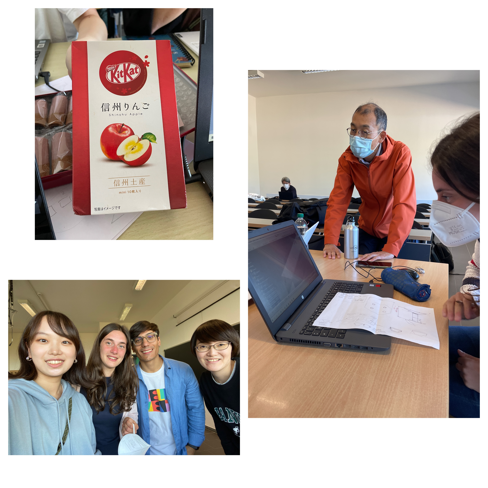
     
     Interested on the topic? Check out the repository [here](https://github.com/FedericoTiberti/Workshop-SkillTransfer) to get insights on how we developed the idea!
- It is a pleasure to post here a picture of my final graduation day:  
  &nbsp;&nbsp;&nbsp;&nbsp;  
  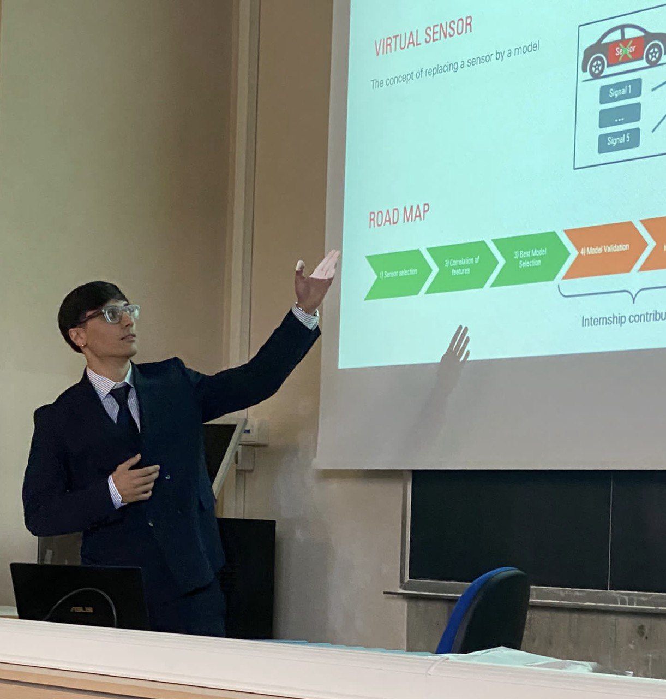

**BSc in Information Engineering (_2018 - 2021_)**
- Basis of the 4 pillars of information engineering: Informatics, Electronics, Telecommunications and Automation.
- In my third year, I focused on automation and completed an experimental thesis using a Crazyflie drone. Here it is a nice picture!  
  &nbsp;&nbsp;&nbsp;&nbsp;  
  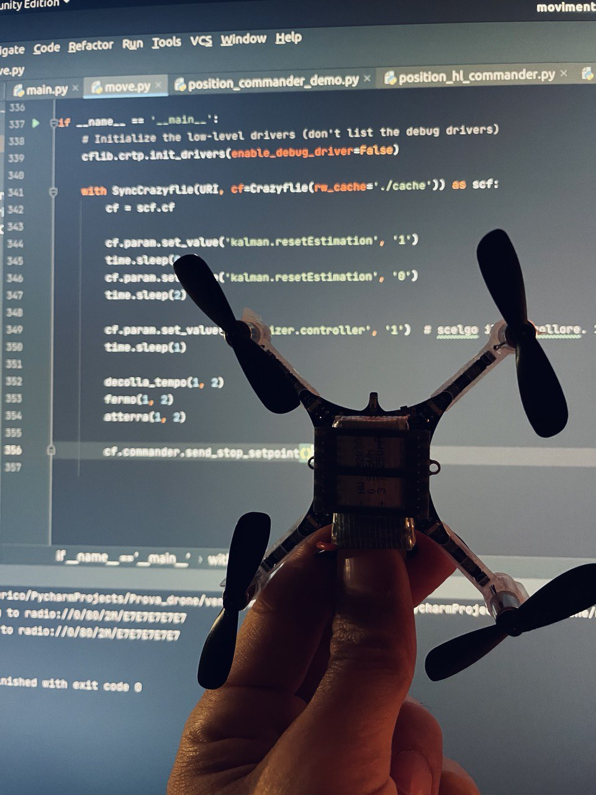

## 24h of Spa-Francorchamps 
June 2023, unforgettable!  
During my time in Brussels, I went to the 24 Hours of Spa with a car that I'm sure didn't go unnoticed! It has been simply incredible to experience the world of motorsport at one of what I believe to be in the top three circuits in the world.  

 
  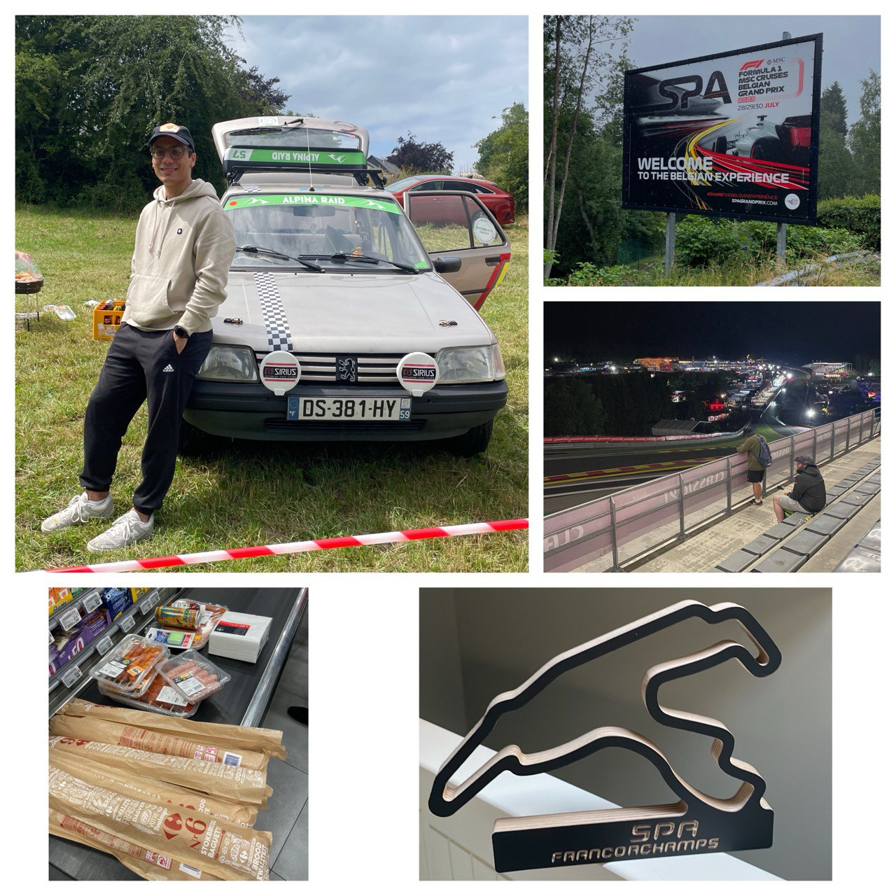

## Sports over the years 🏊‍♂️🏔️🏋️‍♂️
Sport has been a constant passion in my life over the years. In my childhood and adolescence, I was a professional swimmer, and later became a competitive crossfitter, all while engaging in other occasional sports activities, such as climbing Mount Velino at over 2,400 meters in altitude. Swimming taught me exceptional discipline and allowed me to forge unbreakable bonds. Among the photos is a podium shared at a competition in Siena with two lifelong friends back in 2014!

 
  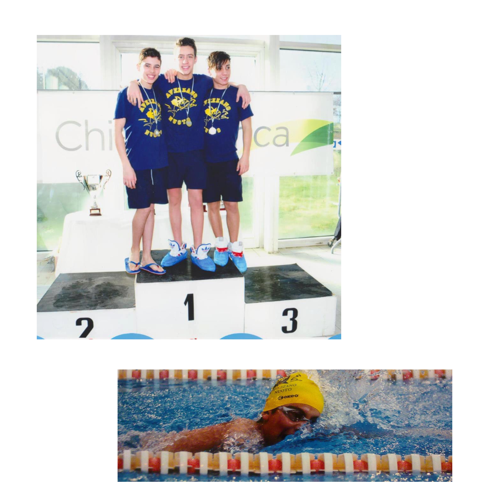
  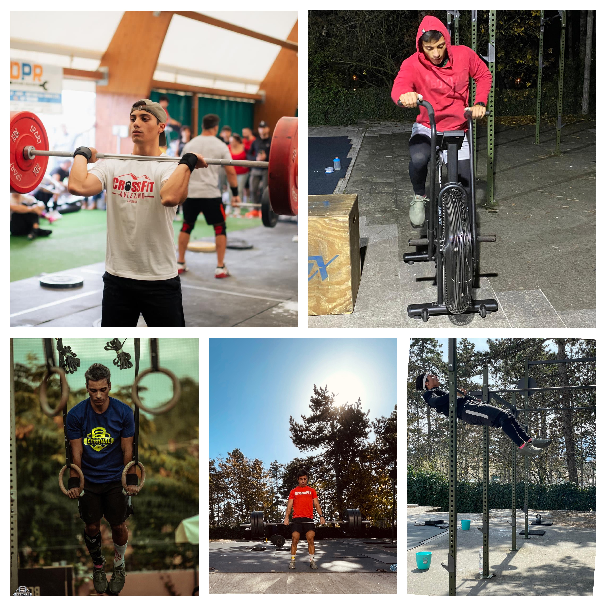
  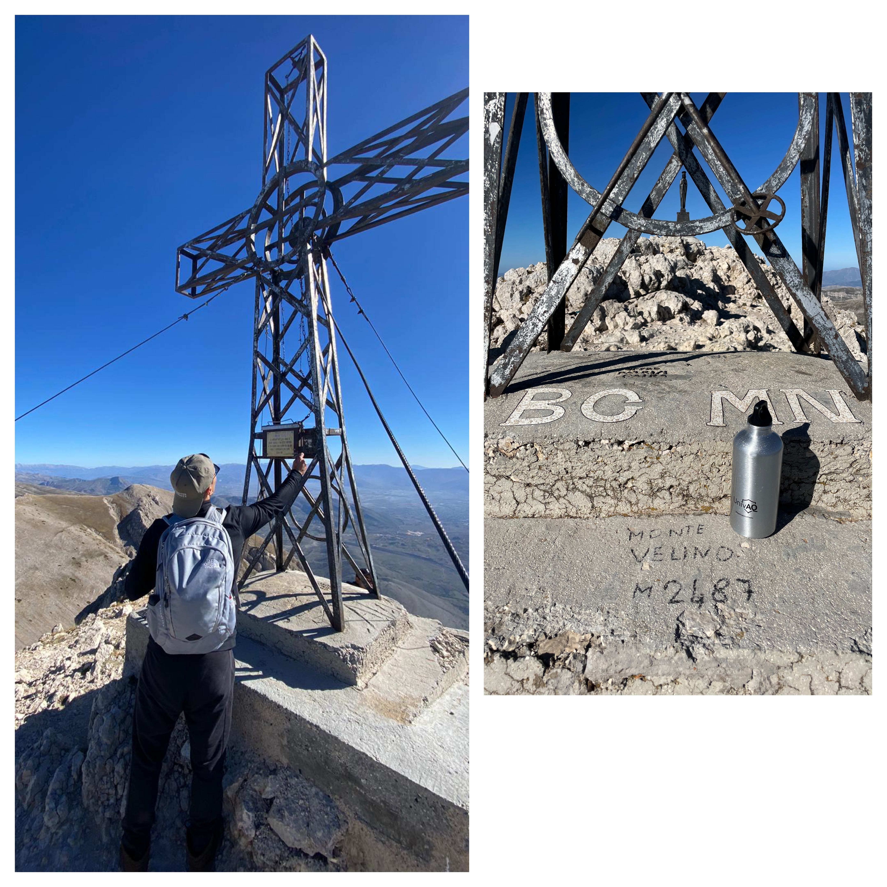

## Telespazio Fucino Space Center 📡
During my last year of high school, we were fortunate to visit the largest civilian teleport in the world, just a few kilometers from the school I attended in Avezzano. It was a unique atmosphere that allowed us to experience the beginnings of telecommunications in the 1960s.  

 
  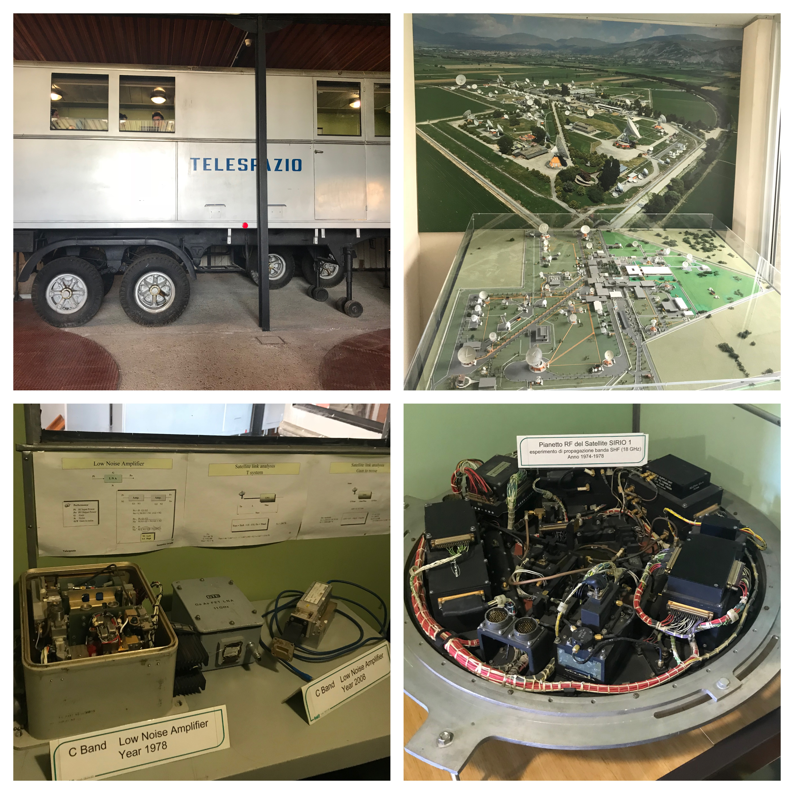

